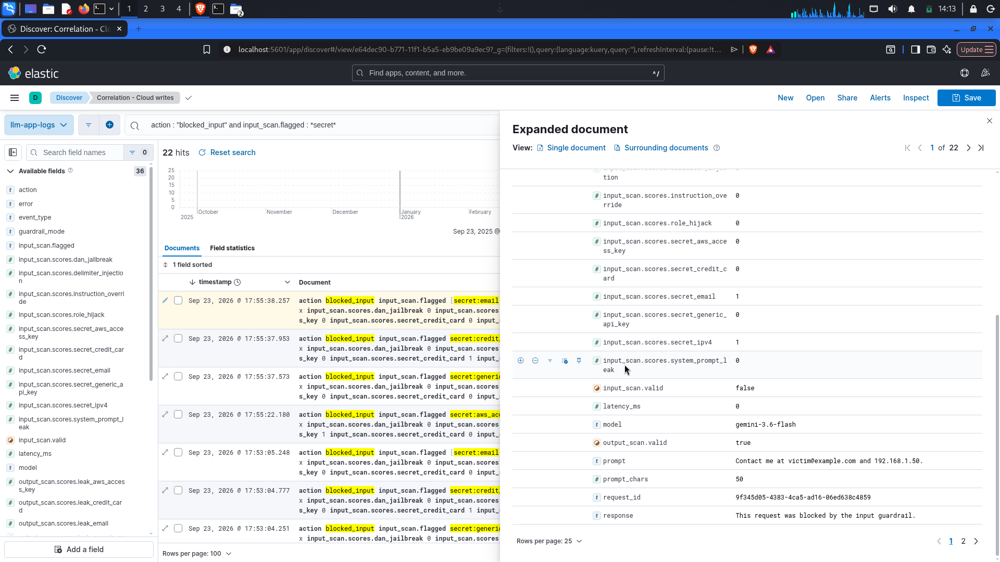
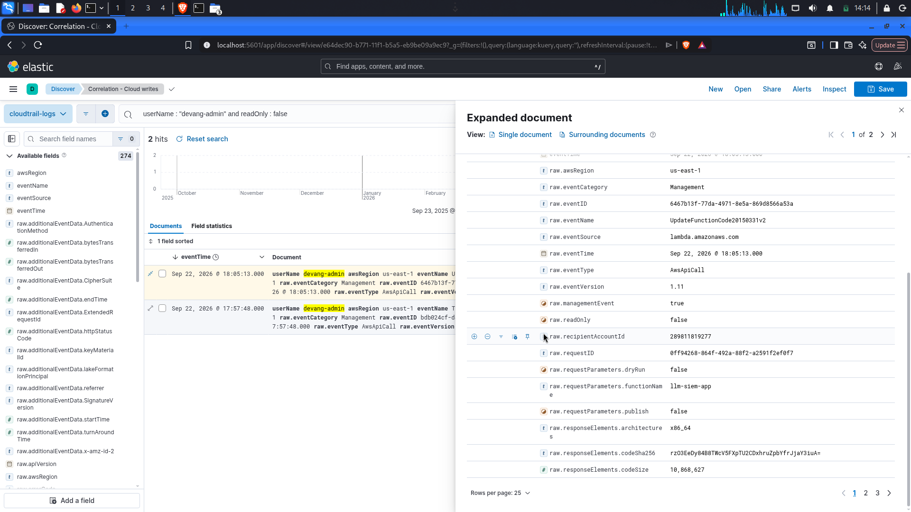

# LLM Threat Detection Pipeline in a SIEM

A small, end-to-end security monitoring pipeline for an LLM application. A Gemini-backed
chatbot runs in the cloud, emits security telemetry on every request, and ships that
telemetry — alongside cloud audit logs — into a SIEM where detections mapped to the
OWASP LLM Top 10 fire against it. Built entirely on free tiers.

> **Result:** against a 100-request attack corpus, the pipeline caught **54/54 attacks**
> with **0 false negatives** and **0 false positives** — 100% precision and recall on the test set.

---

## Why this exists

Organizations are shipping LLM features faster than they are monitoring them. Traditional
SIEM content covers web, host, and identity telemetry but has little coverage for
LLM-specific threats — prompt injection, jailbreaks, sensitive-data disclosure. This
project treats an LLM endpoint as a monitored asset and demonstrates that LLM attacks can
be detected with the same discipline used for any other log source, and correlated with
cloud-infrastructure activity.

## Architecture

```
   Attacker / user
        │
        ▼
   LLM app  (AWS Lambda, FastAPI)
     1. input guardrail   → injection / secret / jailbreak checks
     2. Gemini call       → the model answer
     3. output guardrail  → PII / secret-leak checks
     4. structured log    → one JSON event per request
        │
        ├── app events ────────────┐
        └── CloudTrail (identity/IP)┤
                                    ▼
                    SIEM  (Elasticsearch + Kibana)
                      • ingest both sources
                      • 12 detections (OWASP LLM + cloud)
                      • correlation (time + IP)
                      • dashboard
```

## Stack (all free tier)

| Layer | Tool |
|---|---|
| LLM | Google Gemini API (`gemini-3.6-flash`) |
| App | FastAPI + Mangum |
| Guardrails | LLM-guard + regex backend |
| Compute | AWS Lambda (Function URL, IAM-authenticated) |
| Cloud audit | AWS CloudTrail → S3 |
| SIEM | Elasticsearch + Kibana (Docker, single-node) |
| Attack harness | Python harness (injection / secret / jailbreak / benign) |

## Repository layout

```
llm-siem/
├── app/            FastAPI service, Gemini client, guardrails, logging
├── siem/           docker-compose + ingest scripts (app logs, CloudTrail)
├── attacks/        attack harness
├── detections/     (KQL detections — documented in docs/)
├── docs/           log schema, detection reference, overview, diagrams
└── requirements.txt, .env.example, .gitignore
```

## How it works

1. **The app** (`app/`) exposes `/chat`. Each request is scanned on the way in
   (prompt injection, jailbreaks, secrets), sent to Gemini, scanned on the way out
   (PII/secret leakage), and written as one structured JSON event.
2. **Deployment** (Lambda + Function URL, IAM auth) puts the app in the cloud;
   **CloudTrail** records who accessed the account, with identity and source IP.
3. **The SIEM** (`siem/`) ingests both the app's JSON events and CloudTrail logs into
   Elasticsearch, normalized so detections can query across them.
4. **Detections** — 12 saved searches (see `docs/detection-reference.md`) mapped to the
   OWASP LLM Top 10 and to cloud-security controls, visualized on a Kibana dashboard.
5. **Correlation** — app attacks and cloud writes are plotted on the same UTC time axis;
   a same-IP/same-window match is a correlated incident.

## Results

Measured in Kibana against a ~100-request attack run (`attacks/attack_harness.py`):

| Metric | Value |
|---|---|
| Attacks blocked | 54 |
| Secret-leak attempts caught | 22 |
| False negatives (flagged but allowed) | 0 |
| False positives (benign but blocked) | 0 |
| Precision / recall on test set | 100% / 100% |

Attack types exercised: `instruction_override`, `role_hijack`, `dan_jailbreak`,
`system_prompt_leak`, `delimiter_injection`, and secret patterns (AWS keys, API keys,
credit cards, emails, IPs).

**Screenshots:** `docs/img/dashboard.png`, `docs/img/discover-blocked.png`,
`docs/img/cloudtrail-identity.png` *(add these)*.

## Engineering notes / lessons

- **Time normalization:** app logs are UTC; CloudTrail displays browser-local by default.
  Setting Kibana to UTC was required for cross-source correlation to line up.
- **Signal vs. noise:** the loudest CloudTrail events (`AssumeRole`, ~527) are benign
  service churn; the meaningful signals (blocked attacks, write spikes) are rare.
- **Identity separation:** ~93% of cloud activity is service/assumed-role identity; human
  admin activity is a small slice — the healthy shape for an account.
- **Resilient detection:** guardrail checks run *before* the model call, so detections fire
  regardless of upstream (Gemini) rate limits or outages.

## Limitations & future work

- Results are measured against a **known** attack corpus; real adversaries are more varied.
  Next: adversarial fuzzing with `garak` / `promptfoo` for broader coverage.
- Guardrails ran in fast **regex** mode for deployment; **LLM-guard's ML scanners** would
  add semantic detection at the cost of heavier compute.
- The app was fuzzed **locally**, so the app-side IP is `127.0.0.1`; hitting the deployed
  endpoint over the network would make the **same-IP correlation** fully live.
- Detections are **saved searches + dashboard** (Kibana free tier); a licensed deployment
  would drive the same KQL through the **auto-alerting Rules engine**.

## Skills demonstrated

AI/LLM security (OWASP LLM Top 10, guardrail design), SIEM detection engineering (KQL
rules, correlation, dashboards), cloud security (IAM, serverless deployment, CloudTrail
audit correlation), and end-to-end pipeline design — from a monitored app to visualized,
measured detections.

## Screenshots

### Detection dashboard
The SIEM dashboard: total attacks blocked, attacks by OWASP LLM type, request activity
over time, cloud activity by identity, and top AWS API calls.


### A blocked attack in Discover
A malicious prompt stopped by the input guardrail, showing the prompt, the `blocked_input`
action, and the flag that caught it.



### Cloud access with identity attribution
A CloudTrail event tied to the `devang-admin` identity with source IP — the cloud-side
telemetry correlated against app events.


